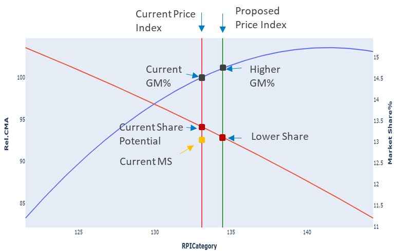

<!-- Slide number: 1 -->

Consumer Surplus Factor (CSF) Workflow

<!-- Slide number: 2 -->
Data Collection
Sales data from IRI, Nielsen, IMRB etc
In-house sales data (Primary or Secondary)

Promo calendars

Data Preparation
Identify the scope of project

Prepare modelling ready data (predefined structure)

EDA and Data validation
EDA dashboard ( Power-BI or Webapp)

Validate the data with Client

Modelling
Feature creation
Build multiple combinations using the created features
Build models using various statistical and machine-learning methods for each combination

Presentation
PowerPoint presentation

Scenario planner ( Excel based )

Webapp (in-future)

Model Results and outputs
Compute MCV, CSF and MSPs at scope level
Calculate RPI curves, Inflection point and recommended price
Model Selection
Filter models using statistical benchmarks

Select final model based on business context

<!-- Slide number: 3 -->
Setting a Strategic Price Index using CSF outputs
Optimal strategic price is the outcome of a scenario planner than enables us trade off between:
Market Share Ambition
Volume
Gross or Contribution Margin
Revenue

Impact of Increase in Price Index

<!-- Slide number: 4 -->
CSF is a measure of value left on the table
How much is a consumer willing to pay Vs. How much are we charging today?

Cohort X

Maximum Consumer Value (MCV)
Value perceived (MAX) = $28
Different cohorts of consumers will perceive different value from brand
Max Consumer value (MCV)
Price to consumer
Consumer Surplus Factor (CSF)   =
Cohort 2
Value perceived = $15
Price to consumer
Cohort 1
Value perceived = $8

MCV is a measure of $ value of emotional and functional attributes, perceived by consumer
People whose perceived value from brand is less than price charged will not be consumers

People whose perceived value from brand is more than price charged will be consumers

### Notes:

<!-- Slide number: 5 -->
Brands with higher CSF can lead price increase and/or target higher market share

Brand ABC
is the best!
Can increase price by 12% without risking share loss
Has potential to gain 3% market share

Brand XYZ
is the best!
Will lose share
Will need to reduce price
Cohort X
MCV = $24

Cohort Y
MCV = $16
CSF = 2.4
CSF = 1.6
Price = $10
Price = $10

Strategic price recommendation from this analysis triangulates perceived value, competitive advantage and market share potential
Brands with higher surplus i.e. ratio of max perceived value to price will be in a position to gain market share
Brands with higher surplus can also increase price without risk of losing market share

<!-- Slide number: 6 -->
#