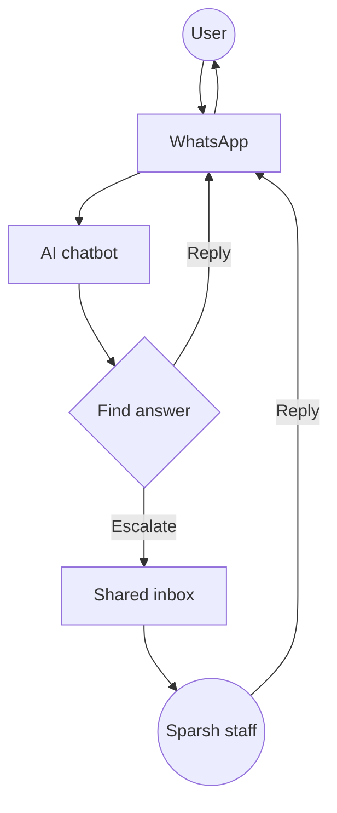

# Sparsh Hospice - Whatsapp AI chatbot
## 1 Overview
Sparsh Hospice is deploying a WhatsApp AI chatbot to answer common questions at scale, with automatic handoff to human staff when needed.

- **What**: AI-powered WhatsApp "front desk" that answers routine questions from a maintained knowledge base; escalates complex/sensitive queries to staff.
- **Why**: Scale support efficiently while maintaining personal touch for complex inquiries.
- **Who**: Sparsh owns all assets and content; AI consultant designs/builds the system and provides maintenance (pro bono).
- **How**: Simple, maintainable setup for non-technical staff with clear escalation workflows.

## 2 Business workflow
1. A person sends a WhatsApp message to Sparsh.
2. The chatbot reads the message and searches the knowledge base for relevant information.
3. If the chatbot finds a confident match, it replies directly on WhatsApp.
4. If the chatbot is unsure, the request is out-of-scope, or the person asks for a human, the conversation is handed off to staff.
5. Staff respond from the shared inbox; the person receives the final response on WhatsApp.

## 3 Roles and responsibilities
This section clarifies ownership across people and vendors.
### 3.1 Sparsh (owner/operator)
- Owns the WhatsApp Business identity and phone number.
- Provides and updates the knowledge base content (plain text).
- Approves user-facing language (templates and disclosure language).
- Responds to escalations in the shared inbox (assume 1 staff member).

### 3.2 AI consultant (designer/maintainer)
- Selects vendors and designs the end-to-end workflow.
- Builds chatbot logic (knowledge-base retrieval, intent routing, confidence thresholds).
- Defines handoff rules and trains the staff member on escalation and handoff.
- Provides light monitoring and maintenance (pro bono).

### 3.3 Third-party vendors
- The implementation requires a number of technical assets provided by third parties (e.g. Whatsapp Business account, AI inference provider account, custom code, etc.).
- Sparsh and consultant work together to select and configure vendors and assets. Consultant helps with the initial implementation and limited ongoing maintenance. Sparsh owns all vendor assets (WhatsApp number, accounts, billing, etc.).

## 4 Technical implementation
This section outlines the technical components and the main implementation options.

### 4.1 Core components
This breaks the system into parts with clear ownership boundaries.
- **WhatsApp transport**: handles inbound/outbound messages and templates. Can use Meta Cloud API directly or a Business Solution Provider (BSP) / Communications Platform as a Service (CPaaS)
- **Shared inbox**: staff UI for escalations and replies.
- **AI chatbot orchestration + retrieval (AI consultant-owned)**: indexing/search, response drafting, confidence checks, and handoff rules.
- **Knowledge base (Sparsh-managed documents)**: source content the chatbot answers from (e.g., Markdown or Docs).
- **Hosting/glue**: webhooks and routing when not suite-hosted.

### 4.2 Implementation options
These options describe how the components are packaged.
1. **Option 1 (full suite)**: transport + shared inbox + admin tooling bundled by one vendor (Trengo, Wati, Interakt, respond.io).
2. **Option 2 (BSP/CPaaS + inbox)**: transport via Twilio/Gupshup/360dialog with a separate team inbox tool.
3. **Option 3 (Meta direct + inbox)**: direct transport via Meta Cloud API with a separate team inbox tool.
4. **Option 4 (Open Source / Self-Hosted)**: Transport via Meta Cloud API connected to open-source tools (Chatwoot for inbox, Typebot/Flowise for bot).

| Component | Option 1: Full suite | Option 2: BSP/CPaaS + inbox | Option 3: Meta direct + inbox | Option 4: Open Source |
| :--- | :--- | :--- | :--- | :--- |
| **Transport** | Vendor-selected | Twilio / Gupshup / 360dialog | Meta Cloud API | Meta Cloud API |
| **Inbox** | Included | Team inbox (SaaS) | Team inbox (SaaS) | **Chatwoot** (Self-hosted) |
| **Chatbot** | Suite automation | External orchestration | External orchestration | **Typebot** or **Flowise** |
| **Knowledge** | Suite KB | Sparsh-managed docs | Sparsh-managed docs | Vector DB (e.g. Pinecone) |
| **Hosting** | SaaS | Webhook + Hosting | Webhook + Hosting | **VPS / Docker** |

### 4.3 Comparison of options
- Option 1 is fastest to deploy with minimal maintenance, but offers limited AI customization and higher vendor lock-in
- Option 2 balances flexibility and effort with moderate customization and control
- Option 3 provides maximum control and lowest costs, but requires significant technical investment and maintenance
- Option 4 offers full data sovereignty and zero license fees but requires managing your own servers and updates.

| Criteria | Option 1: Full suite | Option 2: BSP/CPaaS | Option 3: Meta Direct | Option 4: Open Source |
| :--- | :--- | :--- | :--- | :--- |
| **Ease** | 🟢 Fast | 🟡 Moderate | 🔴 Slow | 🔴 Very Slow (Dev heavy) |
| **Maintenance** | 🟢 Low | 🟡 Moderate | 🔴 High | 🔴 Very High (Server ops) |
| **Customization** | 🔴 Limited | 🟢 Flexible | 🟢 Maximum | 🟢 Maximum |
| **Monthly Cost** | 🟡 $$ | 🟡 $$ | 🟢 $ | 🟢 $ (Server costs only) |
| **Lock-in** | 🔴 High | 🟡 Moderate | 🟢 Low | 🟢 None |

### 4.4 MVP assumptions
- **Volume**: under 1,000 messages/month.
- **WhatsApp number**: provision a new dedicated number; alternative is migrating an existing number.
- **Languages**: English-first for MVP; alternative is English + Telugu + Hindi from day one.
- **Shared inbox complexity**: single-seat shared inbox; alternative is multi-seat with assignment/tags.
- **Escalation triggers**: explicit human request, low confidence, out-of-scope, sensitive topics; alternative is escalate only on explicit human request.
- **Templates and disclosures**: explicit disclosure + clear escalation messaging (including after-hours behavior); alternative is minimal system messages.
- **Data storage and retention**: conservative defaults that minimize retention/logging where practical; alternative is accepting vendor defaults or defining a formal policy first.
- **Bot or model downtime**: auto-escalate all messages to the shared inbox; alternative is fail closed (no replies).

