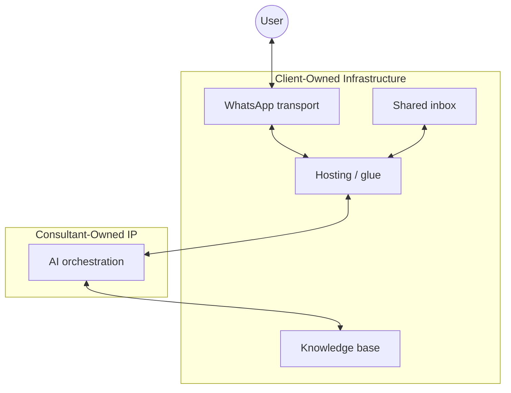

# WhatsApp AI Architecture – Consultant Playbook

## 1 Overview
This document outlines a practical, policy-safe architecture for building AI-powered WhatsApp customer support, especially for non-technical clients and consultants serving both India and the USA.

The goal is to separate WhatsApp plumbing and human workflows from your AI intelligence, so you can reuse the same AI system across clients while adapting to different operational setups.

- **What**: A layered system combining WhatsApp transport, human agent inbox, automation tooling, and AI orchestration
- **Why**: To scale support efficiently while maintaining compliance and human oversight
- **Who**: Consultants serving clients who need AI-assisted WhatsApp support
- **How**: By cleanly separating transport, inbox, and AI layers for reusability and risk management

## 2 Core components of the stack
Every WhatsApp AI system can be decomposed into the following components. This breaks the system into parts with clear ownership boundaries.

### 2.1 WhatsApp transport
Handles inbound/outbound messages and templates.

**Responsibilities:**
- Send and receive WhatsApp messages
- Enforce WhatsApp session rules (24-hour window)
- Template creation and approval
- Deliver message status events (sent, delivered, read, failed)

**Examples:** Meta WhatsApp Cloud API, Twilio, MessageBird, Vonage, Gupshup, 360dialog

This layer is country-agnostic in architecture, though pricing and onboarding vary by region.

### 2.2 Shared inbox (human layer)
Staff UI for escalations and replies.

**Responsibilities:**
- Shared inbox for teams
- Conversation history and context
- Assignment, tagging, resolution
- Seamless handoff from AI to human

**Important:** WhatsApp consumer or business apps cannot serve this role when using the API. If humans exist, an inbox must exist.

**Inbox options:** All-in-one WhatsApp support suites (Wati, Interakt, respond.io), standalone inbox products (respond.io, Front, Helpwise), full helpdesk platforms (Zendesk, Freshdesk, Intercom)

### 2.3 AI orchestration (your core IP)
Indexing/search, response drafting, confidence checks, and handoff rules. This is the layer you build and own.

**Responsibilities:**
- Intent detection and classification
- FAQ answering via RAG
- Tool calls (CRM, orders, bookings)
- Confidence scoring and escalation
- Agent routing (AI vs human)
- Conversation summarization
- Policy enforcement (what AI is allowed to answer)

**This layer should be:** Stateless or lightly stateful, multi-tenant (per client), transport-agnostic

### 2.4 Knowledge base (client-managed)
Source content the chatbot answers from (e.g., Markdown, Docs, Notion).

**Responsibilities:**
- Store FAQs, policies, procedures
- Maintain accurate and up-to-date information
- Client owns and updates content

### 2.5 Hosting / glue
Webhooks and routing when not suite-hosted.

**Responsibilities:**
- Receive webhooks from WhatsApp transport
- Route messages to AI orchestration
- Handle media storage and processing
- Token rotation and authentication

## 3 Implementation patterns and options
These patterns describe how the components are packaged together.

### 3.1 Pattern A: All-in-one WhatsApp Support Suite
- Transport: Vendor-selected
- Shared inbox: Included
- AI orchestration: Suite automation
- Knowledge base: Suite KB
- Hosting: SaaS

**Structure:** WhatsApp transport + shared inbox + admin tooling bundled by one vendor (Wati, Interakt, respond.io, Trengo)

**Best for:** Non-technical clients who want fast setup

**Trade-offs:** Less flexibility, vendor lock-in, faster onboarding

### 3.2 Pattern B: CPaaS + Inbox/Helpdesk
- Transport: Twilio / Gupshup / 360dialog
- Shared inbox: respond.io / Front / Helpwise / Zendesk / Freshdesk / Intercom
- AI orchestration: External orchestration
- Knowledge base: Client-managed docs
- Hosting: Webhook + Hosting

**Structure:** Transport via BSP/CPaaS with a separate team inbox or helpdesk tool

**Best for:** Consultant flexibility, professional support ops, multiple agents and workflows

This is often the best balance for consultants.

**Trade-offs:** More setup, clean separation of concerns, multi-channel ready

### 3.3 Pattern C: Meta Direct + Inbox
- Transport: Meta Cloud API
- Shared inbox: Chatwoot (Cloud) / Team inbox (SaaS)
- AI orchestration: External orchestration
- Knowledge base: Client-managed docs
- Hosting: Webhook + Hosting

**Structure:** Direct transport via Meta Cloud API with a separate team inbox tool

**Best for:** Maximum cost efficiency and control

**Trade-offs:** High technical effort, lowest message costs, zero vendor lock-in

### 3.4 Pattern D: Open Source / Self-Hosted
- Transport: Meta Cloud API
- Shared inbox: Chatwoot (Self-Hosted)
- AI orchestration: Typebot or Flowise
- Knowledge base: Vector DB (e.g., Pinecone)
- Hosting: VPS / Docker

**Structure:** Transport via Meta Cloud API connected to open-source tools

**Best for:** Full data sovereignty and zero license fees

**Trade-offs:** Very high technical effort, server operations responsibility, no license fees

### 3.5 Comparison of patterns

| Criteria | Pattern A: Full suite | Pattern B: CPaaS + inbox/helpdesk | Pattern C: Meta direct | Pattern D: Open source |
| :--- | :--- | :--- | :--- | :--- |
| **Ease of setup** | Fast | Moderate | Slow | Very slow |
| **Maintenance** | Low | Moderate | High | Very high |
| **Customization** | Limited | Flexible | Maximum | Maximum |
| **Monthly cost** | $$ | $$ | $ | $ |
| **Lock-in risk** | High | Moderate | Low | None |
| **Best for** | Non-technical clients | Consultant flexibility | Cost efficiency | Data sovereignty |

## 4 Key decisions and recommendations

### 4.1 Ownership and identity
**Who owns the WhatsApp identity?**

Recommended: Client owns the WhatsApp number and business account, you operate as a service provider

Avoid: Reusing your own number for multiple clients

### 4.2 Human workflows
**Where do humans work?**

Options: Support suite inbox, standalone inbox, full helpdesk

Rule: If humans exist, an inbox is non-negotiable

**What does the AI handle vs escalate?**

Define explicitly: Allowed intents, disallowed or sensitive intents, confidence thresholds, explicit handoff triggers ("agent", complaints, refunds)

**How are templates managed?**

Best practice: Consultant drafts initial templates, client approves wording, platform handles submission and lifecycle

Templates are operationally critical, not optional.

### 4.3 Policy and safety guardrails
These guardrails are critical for compliance and risk management.

- Bot must be clearly scoped to the business
- No general-purpose or open-ended AI behavior
- Clear disclosure that the user is chatting with an automated assistant
- Easy human escalation
- Strict tenant isolation between clients

Think of the AI as business workflow intelligence, not a conversational companion.

### 4.4 Regional considerations
Architecture is the same. Differences are mostly:

- WhatsApp pricing per country
- Billing and payments
- Vendor availability

Design for portability; swap vendors per client if needed.

### 4.5 Recommended consultant default
For non-technical clients with manual WhatsApp today:

**Recommended setup:** Client-owned WhatsApp number, business inbox (suite or standalone), your AI orchestrator via webhooks

**Positioning:** You sell "AI-assisted WhatsApp support" not "An AI chatbot on WhatsApp"

This framing keeps you compliant, scalable, and credible.

---

## Appendix: Vendor comparison

### 1. Feature Matrix (SaaS Solutions)

| Feature | **Respond.io** | **Wati** | **Interakt** | **Trengo** |
| :--- | :--- | :--- | :--- | :--- |
| **Primary Focus** | Automation & Aggregation | Simple SMB Marketing | D2C / E-commerce | Customer Support |
| **Inbox Quality** | Omnichannel | WhatsApp only | Basic | Unified |
| **Chatbot Builder** | Advanced (Workflow based) | Intermediate (Keyword/Flow) | Basic (Lists/Menus) | Intermediate (Flowbot) |
| **AI Capabilities** | Strong (AI Agent, Prompts) | Moderate (KnowBot) | Moderate (Haptik AI) | Moderate (Suggested) |
| **Pricing Model** | Flat Fee + Usage (No markup) | Tiered + Add-ons + Markup | Low Base + High Markup | Per Seat / Bundle |

### 2. Infrastructure & API Providers

| Feature | **360dialog** | **Twilio** | **Gupshup** | **Meta Cloud API** |
| :--- | :--- | :--- | :--- | :--- |
| **Primary Focus** | API / CRM "Glue" | Developer Platform | Enterprise CPaaS | Direct Connectivity |
| **Setup Difficulty** | Moderate | Dev required | Dev required | High effort |
| **Msg Markup** | None | ~$0.005 / msg | ~$0.001 / msg | None |
| **Best For** | Connecting to CRMs | Custom Engineering | Large Enterprise Volume | Max Cost Efficiency |

### 3. Open Source / Self-Hosted Stack
**Warning:** Only use official Meta Cloud API or authorized BSPs. Avoid unofficial tools like "Evolution API" or "Baileys"—these reverse-engineer the WhatsApp web protocol and carry a high risk of permanent number banning.

**Chatwoot** (Inbox)
- Role: Replaces Intercom/Zendesk. Provides the staff UI for replying to messages.
- Connectivity: Connects natively to Meta Cloud API (Official). Can also connect via Twilio.
- Options: Cloud (SaaS) or Self-Hosted.
- Pros: Excellent UI, open-source core, supports mobile apps, fits Pattern C (Direct) perfectly.
- Cons: Self-hosting requires managing a Rails + Redis + Postgres stack. Cloud version is paid.

**Typebot.io** (Chatbot Builder)
- Role: The "front-line" bot. Visual drag-and-drop builder for WhatsApp.
- Connectivity: Can hand off to Chatwoot when a human is needed.
- Pros: Best-in-class visual builder, open-source.
- Cons: Hosting requires technical knowledge (Docker).

**Flowise / Dify** (AI Orchestration)
- Role: The "Brain". If you need complex RAG (Knowledge Base) beyond simple menus.
- Pros: Visual "LangChain" builders.
- Cons: Adds another moving part to maintain.

### 4. Vendor summaries

**Respond.io** (Recommended for Scale)
- Product: A heavy-duty conversation management platform. It aggregates WhatsApp, Telegram, Messenger, and Email into one inbox.
- Pricing: Platform starts ~$79/mo (Team) to ~$159/mo (Growth). Zero markup on message fees.
- Pros: Best-in-class workflow builder, sophisticated AI agent (included credits), no message markups save money at scale.
- Cons: Higher starting price. Overkill if you only want a simple auto-reply.

**Wati** (Good for Simple Automation)
- Product: A user-friendly, dedicated WhatsApp tool. Very popular with non-technical teams.
- Pricing: Platform ~$59/mo (Growth) to ~$279/mo (Business). Applies markup on message fees.
- Pros: Extremely easy "KnowBot" setup, great broadcast UI.
- Cons: "Success tax" — as you grow (more msgs/automations), the bill rises faster due to markups and add-ons.

**Interakt** (Best for Low Volume / E-commerce)
- Product: Built by Jio Haptik, designed for Shopify stores and D2C brands.
- Pricing: Platform ~$15/mo. High markup on message fees (~12% on marketing, ~39% on utility).
- Pros: Cheapest way to start. Excellent Shopify integration (abandoned cart recovery, order status).
- Cons: The high markup makes it expensive for high-volume support. The inbox is less powerful for complex support tickets.

**Trengo** (Best for Support Teams)
- Product: A unified inbox replacing tools like Zendesk. Handles Email, Voice, and Chat.
- Pricing: Per-seat pricing (e.g., €20-€35/user) or Bundles (€299+).
- Pros: Unified view of a customer (email history + chat history).
- Cons: Expensive if you don't use the email/voice features. Flowbot is strictly rule-based (less AI).

**360dialog** (Best for "No-Code" Connectors)
- Product: A specialized "API proxy". Ideal if you use a CRM (like Pipedrive, HubSpot) that doesn't have native WhatsApp but integrates with 360dialog.
- Pricing: ~€50/mo per number. Zero markup on messages.
- Pros: High stability, "official" partner status often gives better throughput.
- Cons: No usable inbox included.

**Twilio** (Best for Developers)
- Product: The world's leading developer platform. You write code to send/receive messages.
- Pricing: Pay-as-you-go. Adds a flat ~$0.005 markup per message (inbound & outbound).
- Pros: Extremely reliable, incredible documentation, "Programmable Messaging" gives you 100% control.
- Cons: High per-message markup compared to others. Requires a developer to build the "Inbox" UI or connect it to one (like Flex).

**Gupshup** (Best for Enterprise)
- Product: A massive enterprise CPaaS. Good for banking/airline scale.
- Pricing: Custom enterprise quotes. Typically small markup (~$0.001) but high minimums.
- Pros: Indian market dominance, high throughput.
- Cons: "Sales-led" (hard to just sign up), complex interface for small teams.

**Meta Cloud API** (Best for "Do It Yourself")
- Product: The raw API hosted by Meta.
- Pricing: Free hosting. You pay strictly the per-conversation/message rates to Meta.
- Pros: Lowest possible cost.
- Cons: Zero interface. You must build your own server to handle webhooks, media, and token rotation.

### 5. Total Cost of Ownership (TCO) Guide
When calculating the budget, use this formula:
$$ \text{Total Monthly Cost} = \text{Platform Fee} + (\text{Msg Volume} \times \text{Meta Rate}) + (\text{Msg Volume} \times \text{Vendor Markup}) + \text{Add-ons} $$

**Example Scenario:** 1,000 Service conversations + 500 Marketing messages (India rates).

1. **Respond.io:** Platform $79 + Meta Fees ~$4 + Markup $0 = ~$83
2. **Interakt:** Platform $15 + Meta Fees ~$4 + Markup ~$1.50 = ~$20.50 (Cheaper at low volume)
3. **Twilio API (Custom Build):** Platform $0 + Meta Fees ~$4 + Markup ~$7.50 = ~$11.50 (Plus engineering cost)

Verdict: Interakt wins on low volume. Respond.io wins on high volume or complex automation needs.
