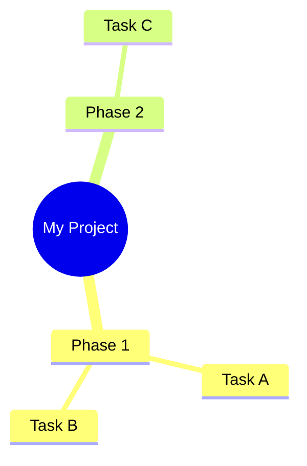

## Mind map
- test
	- test 1a
	- test 1b
- test 2

## Mindmapping and diagramming
```d2
x -> y: hello world
```


```d2
My Project: {
  Phase 1: {
    Task A
    Task B
  }
  Phase 2: {
    Task C
  }
}
```




```d2
vars: {
  d2-config: {
    layout-engine: dagre
    theme-id: 200
    sketch: true # This gives it a hand-drawn, organic feel
  }
}

Root: My Brain {
  shape: circle # Root as a circle
}

Root -> Idea 1
Root -> Idea 2
Root -> Idea 3

# Make the child nodes just text (no boxes)
Idea 1: {
  shape: text
}
Idea 2: {
  shape: text
}
Idea 3: {
  shape: text
}

# Further branching
Idea 1 -> Sub-point A
Idea 1 -> Sub-point B
```