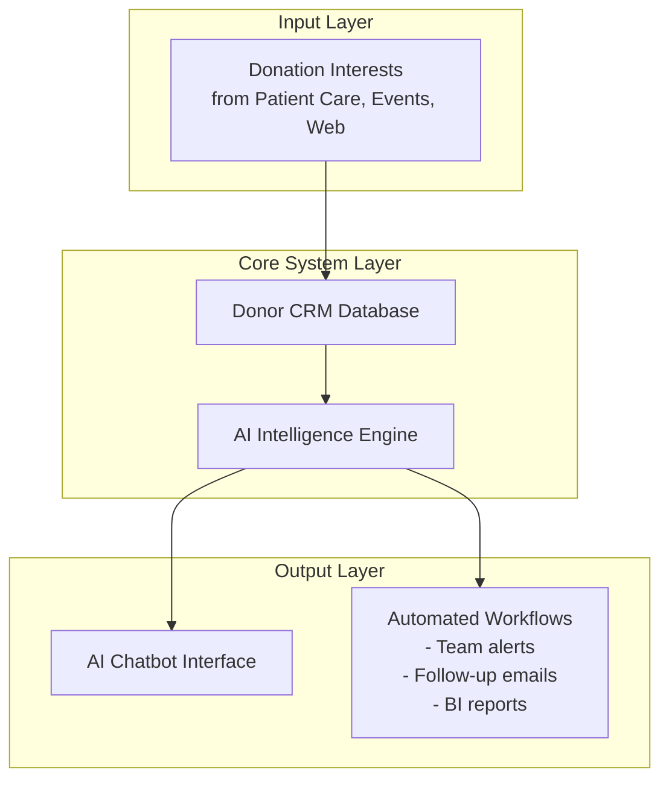
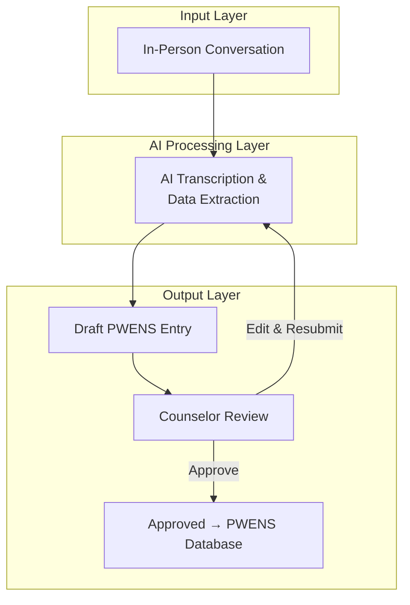

# Project proposal

**Client:** Sparsh Hospice
**Date:** January 15, 2026
**Valid until:** March 31, 2026

---

## Executive summary

Through discovery conversations with your counseling and donor management teams, we identified two major opportunities to strengthen Sparsh's operations through AI:

- **AI-powered donor management system** - Systematically capture donation interests expressed during patient care, build unified donor database, identify and cultivate major donors automatically
- **AI documentation assistant** - Eliminate 50+ minutes of daily manual documentation burden, ensure no inquiry is lost, enable real-time care coordination

**Timeline:** 5-6 weeks total, with first results in 3 weeks | **Investment:** Pro bono engagement

---

## The business problem

Sparsh provides exceptional hospice care but operates with manual, fragmented systems:

**Donor management:**
- No unified database (Excel-based tracking, disconnected from patient care)
- Donation interests expressed during care are rarely captured or followed up
- Major donors identified 12+ months late through annual manual reconciliation

**Documentation burden:**
- 300 inquiries monthly trapped in personal notebooks (not searchable, lost when staff leave)
- Counseling team spends 50+ minutes daily on manual transcription = 4+ hours not spent on patient care
- Field staff struggle with typing burden and poor network connectivity
- No real-time inquiry visibility or analytics capability

---

## The solution

### Solution 1: AI-powered donor management system

Automatically capture donation interests, build unified donor database, identify major donors in real-time, and nurture donor relationships.

**How it works:**

**Key capabilities:**
- AI automatically detects donation interest from patient interactions and event sign-ups (future: WhatsApp integration)
- Real-time identification of high-potential donors (HNIs, repeat donors, corporate prospects)
- Automated lead scoring and segmentation for personalized outreach (future: nurture campaigns)
- Unified donor CRM connects all touchpoints into single source of truth with built-in reporting

**Business outcomes:**
- Never miss a donation interest expressed during care
- Identify major donors 12+ months faster than annual reconciliation
- Spend less time on manual tracking and follow-up
- Build sustainable donor pipeline with data-driven insights

### Solution 2: AI documentation assistant

Transform voice notes and conversations into structured patient records in under 5 minutes using AI transcription and data extraction.

**How it works:**

**Key capabilities:**
- AI transcribes voice notes in real-time from in-person conversations (future: phone calls, WhatsApp)
- Automatically extracts structured data (patient details, symptoms, urgency level)
- Generates draft entry that counselor reviews and approves before updating PWENS
- Counselor can edit or provide feedback, AI learns from corrections
- Creates complete record accessible across care teams (future: searchable database, AI-powered chat for inquiries)

**Business outcomes:**
- Reclaim 4+ hours daily for patient care instead of documentation
- Complete, searchable record of every inquiry (no more lost notebooks)
- Real-time visibility into all inquiries across the team
- No institutional knowledge lost when staff leave

---

## Business results you can expect

### Donor management outcomes

| Outcome | Current state | Future state | Impact |
| --- | --- | --- | --- |
| Donor identification | Annual manual reconciliation | Real-time tracking | 12+ months faster major donor cultivation |
| Lead follow-up | Manual, ad-hoc | Automated notifications | 0% lost donation interests |
| Donor database | Excel sheets, disconnected | Unified database | Data-driven fundraising decisions |

### Documentation outcomes

| Outcome | Current state | Future state | Impact |
| --- | --- | --- | --- |
| Documentation time | 50+ minutes daily | <5 minutes per inquiry | 4+ hours reclaimed for patient care daily |
| Inquiry capture | Paper notebooks, lost data | 100% digital, searchable | Complete record, no data loss |

---

## What's not included

- PWENS core system modifications (we can extend existing functionality but won't rebuild)
- Clinical decision support tools 
- Full marketing automation platform (beyond donor nurture campaigns)
- 24/7 support or ongoing maintenance (handoff after 30-day support period)

---

## Investment and timeline

### Investment

**Pro bono engagement** - No consulting fees

**What we provide:** Requirements analysis, technology evaluation, custom implementation, documentation, training, change management support, 30-day post-launch support

**What we need from Sparsh:** Team access for interviews, decision-making authority, 4-6 hours for testing/training, honest feedback, designated point of contact

**Third-party costs:** Sparsh responsible for any software licensing or hosting costs (we'll recommend free/low-cost options), ongoing maintenance after 30-day support period

### Timeline

**Start:** [Date after approval]
**First results:** [Date - counseling team sees time savings in ~3 weeks]
**Complete:** [Date - 5-6 weeks from start]

**Phase 1: Discovery (1 week)**
- Team interviews and workflow mapping
- Solution design and architecture approval

**Phase 2: Implementation (3-4 weeks)**
- Parallel development of both systems
- Regular check-ins and demos

**Phase 3: Launch and handoff (1 week)**
- Both systems go live
- Team training and documentation delivery
- Knowledge transfer complete

Timeline flexible based on your priorities and team availability.

---

## Next steps

1. **Review this proposal** with your team and leadership
2. **Schedule Q&A** to discuss questions and refinements
3. **Approve scope** and kickoff discovery phase
4. **Execute implementation** with regular check-ins
5. **Delivery, training,** and handoff

---

**Questions?** [Your email/phone]

Thank you for the opportunity to support Sparsh's mission. We're excited to apply AI to help you serve more patients and build sustainable donor relationships.
