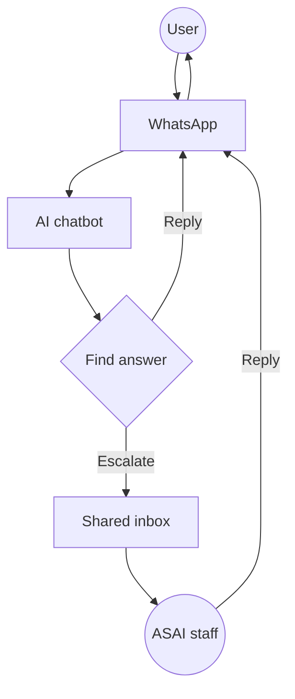

# ASAI - Whatsapp AI chatbot
## 1 Overview
ASAI (Art and Science of AI) is deploying a WhatsApp AI chatbot to answer common questions at scale, with automatic handoff to human staff when needed.

- **What**: AI-powered WhatsApp "front desk" that answers routine questions from a maintained knowledge base; escalates complex/sensitive queries to staff.
- **Why**: Scale support efficiently while maintaining personal touch for complex inquiries.
- **Who**: ASAI owns all assets and content; builds and maintains the system.
- **How**: Developer-friendly, self-hosted setup with full data ownership and sovereignty.

## 2 Business workflow
1. A person sends a WhatsApp message to ASAI.
2. The chatbot reads the message and searches the knowledge base for relevant information.
3. If the chatbot finds a confident match, it replies directly on WhatsApp.
4. If the chatbot is unsure, the request is out-of-scope, or the person asks for a human, the conversation is handed off to staff.
5. Staff respond from the shared inbox; the person receives the final response on WhatsApp.

## 3 Roles and responsibilities

ASAI owns and operates the entire system internally.

### 3.1 ASAI (owner/operator/implementer)
- Owns the WhatsApp Business identity and phone number
- Provides and updates the knowledge base content (plain text)
- Approves user-facing language (templates and disclosure language)
- Responds to escalations in the shared inbox
- Designs, builds, and deploys all infrastructure
- Selects open-source and developer-friendly tools
- Ongoing maintenance and troubleshooting support
- Full data ownership and sovereignty

## 4 Technical implementation

This section follows the 5-layer architecture from whatsapp-ai-architecture.md, with options optimized for data sovereignty and developer-friendliness.

### 4.1 Layer 1: WhatsApp Transport (Messaging API)

Handles sending/receiving WhatsApp messages and enforcing session rules.

| Option | Developer DX | Data Control | Monthly Cost | Markup | Notes |
| :--- | :--- | :--- | :--- | :--- | :--- |
| **Twilio** | 🟢 Excellent | 🟡 Partial | $0.005/msg | Yes | Best docs, SDKs, CLI tools |
| **Meta Cloud API** | 🔴 Raw | 🟢 Complete | Free + Meta fees | None | Max control, lowest cost |
| **360dialog** | 🟡 Good | 🟢 Complete | ~€50/mo | None | CRM connectors, stable |
| **MessageBird** | 🟢 Excellent | 🟡 Partial | $0.004/msg | Yes | Similar to Twilio, EU-focused |

**Twilio** (Best DX)
- Programmable Messaging API with webhooks
- Excellent documentation across all languages
- Twilio Console for debugging message logs
- CLI tool: `twilio phone-numbers:update`
- Unified APIs across SMS, WhatsApp, Email

**Meta Cloud API** (Best sovereignty)
- Lowest possible cost (no markup)
- Full access to all WhatsApp features
- Requires building webhook server
- Token rotation and rate limiting to manage
- Graph API documentation (less polished)

### 4.2 Layer 2: Inbox / Agent UI

Where humans read and reply to conversations. Mandatory when AI is involved.

| Option | Type | Developer DX | Data Control | Cost | Notes |
| :--- | :--- | :--- | :--- | :--- | :--- |
| **Chatwoot** | Self-hosted | 🟡 Good | 🟢 Complete | VPS cost | Open-source, Rails, Docker |
| **Front** | SaaS | 🟢 Excellent | 🔴 Vendor | ~$19-50/user | Polished UI, API-first |
| **respond.io** | SaaS | 🟢 Excellent | 🔴 Vendor | ~$79+/mo | WhatsApp-focused, omnichannel |
| **Helpwise** | SaaS | 🟡 Good | 🔴 Vendor | ~$15-20/user | Simple shared inbox |

**Chatwoot** (Best sovereignty)
- Self-hosted: full database access
- Channels: WhatsApp, Website, Email, Facebook, Twitter
- Multi-agent support with assignment
- API for conversation management
- Mobile apps (iOS/Android)
- Deployment: Docker Compose

**Front** (Best DX)
- Best-in-class developer experience
- Webhooks and API for automation
- Powerful rules and routing
- Integrated analytics
- Slack-like collaboration

### 4.3 Layer 3: Helpdesk / Workflow (Optional)

Advanced ticketing with SLAs, priorities, roles. Only needed as teams grow.

| Option | Type | Developer DX | Data Control | Cost | Notes |
| :--- | :--- | :--- | :--- | :--- | :--- |
| **Zendesk** | SaaS | 🟢 Excellent | 🔴 Vendor | ~$50-115+/agent | Full-featured helpdesk |
| **Freshdesk** | SaaS | 🟢 Excellent | 🔴 Vendor | ~$29-79+/agent | Good mid-tier option |
| **Intercom** | SaaS | 🟢 Excellent | 🔴 Vendor | ~$74-119+/seat | Conversational support |

**Note:** For MVP, skip this layer. Use Chatwoot or Front (Layer 2) which have basic assignment and tagging built-in. Add Layer 3 when you need SLAs, complex permissions, or multi-channel beyond messaging.

### 4.4 Layer 4: Automation & Compliance

Templates, opt-ins, disclosure, rate limits. Often bundled with other layers.

| Bundled with | Templates | Opt-in tracking | Disclosure | Notes |
| :--- | :--- | :--- | :--- | :--- |
| **Chatwoot** | 🟡 Basic | 🟡 Manual | Manual | You manage compliance |
| **Twilio** | 🟢 Full API | 🟡 Manual | Manual | API for template submission |
| **Front** | 🟢 Native | 🟢 Yes | Manual | Built-in template tools |
| **360dialog** | 🟢 Full | 🟢 Yes | Manual | WhatsApp Business API proxy |

**Important:** WhatsApp templates require Meta approval before use. This is true regardless of which transport you choose.

### 4.5 Layer 5: AI Orchestration

Intent detection, RAG, confidence scoring, escalation logic. This is your core IP.

| Option | Type | Developer DX | Data Control | Cost | Notes |
| :--- | :--- | :--- | :--- | :--- | :--- |
| **Flowise** | Self-hosted | 🟢 Visual | 🟢 Complete | VPS cost | Drag-drop LangChain |
| **Dify** | Self-hosted | 🟢 Visual | 🟢 Complete | VPS cost | More features, RAG-focused |
| **LangChain** | Code | 🟡 Flexible | 🟢 Complete | API costs | Python/TS, max control |
| **LangFlow** | Self-hosted | 🟢 Visual | 🟢 Complete | VPS cost | Similar to Flowise |

**Flowise** (Recommended for visual DX)
- Docker-based deployment
- Visual workflow builder (no code)
- Built-in integrations (OpenAI, Anthropic, Ollama)
- API endpoints for each flow
- Export workflows as JSON

**Dify** (More comprehensive)
- Better RAG pipeline with chunking
- Support for agents and tools
- Dataset management UI
- API-first design

**LangChain** (Max flexibility)
- Python and TypeScript support
- Maximum control over logic
- Large ecosystem and community
- Requires more development effort

### 4.6 Supporting: Vector Database

For RAG knowledge base storage and retrieval.

| Option | Type | Developer DX | Data Control | Cost | Notes |
| :--- | :--- | :--- | :--- | :--- | :--- |
| **pgvector** | Self-hosted | 🟢 SQL-native | 🟢 Complete | $0 | PostgreSQL extension |
| **Qdrant** | Self-hosted | 🟢 Good | 🟢 Complete | $0 | Rust-based, fast, filtering |
| **Chroma** | Self-hosted | 🟢 Simple | 🟢 Complete | $0 | Python-native, embedded |
| **Pinecone** | Managed | 🟢 Excellent | 🔴 Vendor | $70-900/mo | Best DX, auto-scaling |
| **Weaviate** | Self/Managed | 🟡 Moderate | 🟢 Complete | VPS or paid | GraphQL API, modular |

**pgvector highlights:**
- PostgreSQL extension, no separate service
- SQL-based queries with familiar syntax
- Works with Chatwoot's existing database
- Backup strategy covers vectors too
- Good for smaller datasets (<1M vectors)

**Qdrant highlights:**
- Purpose-built for vectors
- HTTP API and client libraries
- Powerful filtering capabilities
- Supports quantization for smaller indices
- Docker deployment

**Pinecone highlights:**
- Best developer experience
- Fully managed (zero ops)
- Expensive for production
- Free tier available (1 index, limited)

### 4.6 LLM inference options

| Option | Type | Developer DX | Data Control | Cost | Notes |
| :--- | :--- | :--- | :--- | :--- | :--- |
| **OpenAI** | API | 🟢 Excellent | 🔴 Vendor | ~$0.15/M input | GPT-4o-mini is fast and cheap |
| **Anthropic** | API | 🟢 Excellent | 🔴 Vendor | ~$0.25/M input | Claude Haiku for fast responses |
| **Ollama** | Self-hosted | 🟡 Moderate | 🟢 Complete | $0 (GPU cost) | Local models, full privacy |
| **Groq** | API | 🟢 Excellent | 🔴 Vendor | ~$0.05-0.59/M | Fastest inference (LPU) |
| **Together AI** | API | 🟡 Good | 🔴 Vendor | ~$0.10-0.90/M | Open source models hosted |

**OpenAI highlights:**
- GPT-4o-mini: fast, cheap, capable
- Excellent documentation and examples
- Structured output support
- Function calling for tools

**Ollama highlights:**
- Run models locally (Llama 3, Mistral, etc.)
- Full data sovereignty
- GPU required for good performance
- Simple CLI and HTTP API
- Can self-host for clients with privacy needs

### 4.7 Example stacks

Here are some example stacks combining the above options:

**Stack A: Maximum sovereignty (recommended)**
- Transport: Meta Cloud API
- Inbox: Chatwoot (self-hosted)
- Orchestration: Flowise (self-hosted)
- Vector DB: pgvector
- LLM: Ollama or OpenAI API
- Hosting: Hetzner VPS ($5-10/mo)
- **Monthly cost: ~$7-17/mo + message fees**

**Stack B: Developer experience + sovereignty**
- Transport: Twilio
- Inbox: Chatwoot (self-hosted)
- Orchestration: Dify (self-hosted)
- Vector DB: Qdrant
- LLM: OpenAI API
- Hosting: DigitalOcean ($8/mo)
- **Monthly cost: ~$15-25/mo + message + API fees**

**Stack C: Fastest to MVP**
- Transport: Twilio
- Inbox: Front (SaaS)
- Orchestration: LangCloud or Flowise Cloud
- Vector DB: Pinecone
- LLM: OpenAI API
- Hosting: Minimal (serverless)
- **Monthly cost: ~$70-150/mo + message + API fees**

**Stack D: Homelab / On-premise**
- Transport: Meta Cloud API
- Inbox: Chatwoot (self-hosted)
- Orchestration: Flowise (self-hosted)
- Vector DB: pgvector
- LLM: Ollama (local)
- Hosting: Own hardware
- **Monthly cost: ~$0 + message fees**

### 4.8 MVP assumptions

**Infrastructure**
- **Hosting**: Single VPS (2-4GB RAM, 2 vCPU) or homelab server
- **Deployment**: Docker Compose for all services
- **Backup**: Automated database backups to remote storage
- **Monitoring**: Basic health checks and logs (Uptime Kuma or similar)

**Volume and scale**
- **Volume**: Under 1,000 messages/month initially
- **WhatsApp number**: New dedicated number via Meta Business Suite
- **Languages**: English-first; extensible to other languages

**AI configuration**
- **Model**: Start with API-based (OpenAI GPT-4o-mini or Claude Haiku) for reliability
- **Fallback**: Local models (Ollama/Llama) for privacy-sensitive content
- **RAG**: Simple similarity search over documents
- **Confidence threshold**: Configurable (default: 0.7)

**Shared inbox**
- **Single-seat**: Primary owner responds to escalations
- **Multi-seat**: Add team members as needed (Chatwoot supports multi-user)

**Escalation triggers**
- Explicit human request ("agent", "human", "speak to person")
- Low confidence responses (below threshold)
- Out-of-scope queries
- Sensitive topics (complaints, legal, medical)

**Data and privacy**
- **Storage**: All message data stored on your infrastructure
- **Retention**: Configurable (default: 90 days)
- **Compliance**: Full data access and export capabilities
- **No training**: Conversations not used to train third-party models

**Reliability**
- **Bot downtime**: Auto-escalate to shared inbox
- **Server downtime**: Queue messages for processing when back online
- **Monitoring**: Alerts for service failures

### 4.9 Cost comparison

**Monthly costs** by stack:

| Stack | Monthly | Notes |
| :--- | :--- | :--- |
| **Stack A** (Max sovereignty) | ~$7-17/mo | VPS + optional LLM API |
| **Stack B** (DX + sovereignty) | ~$15-25/mo | VPS + Twilio markup + API |
| **Stack C** (Fastest MVP) | ~$70-150/mo | SaaS platform fees + API |
| **Stack D** (Homelab) | ~$0 + message fees | Hardware cost only |

**Component-level costs**:
- VPS (2-4GB): $5-10/mo (Hetzner, DO)
- WhatsApp messages (India): ~$0.0085/conversation
- Twilio markup: ~$0.005/msg (inbound + outbound)
- LLM API: $1-10/mo (typical usage)
- Vector storage: $0 (self-hosted) or $70-900/mo (Pinecone)
- Monitoring: $0 (self-hosted) or ~$5/mo (UptimeRobot)

**Comparison with SaaS suites** (1,000 conversations/month):
- Self-hosted: ~$15-25/mo
- Respond.io: ~$80-90/mo
- Wati: ~$70-100/mo (with markups)
- Interakt: ~$20-30/mo (high markup at scale)
